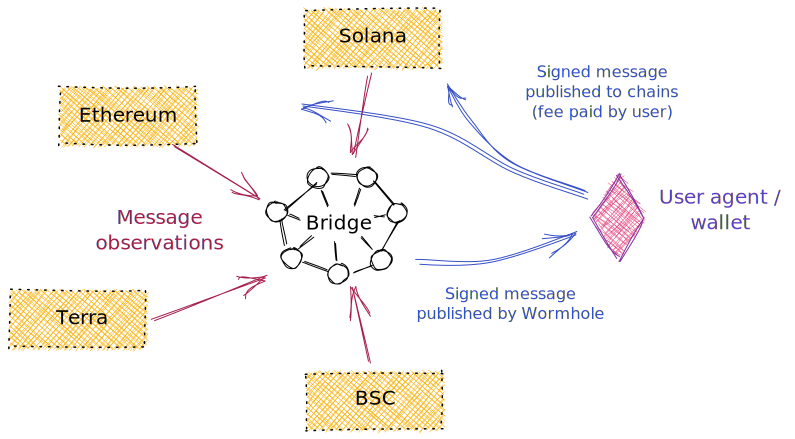

# Wormhole v2

See [DEVELOP.md](DEVELOP.md) for instructions on how to set up a local devnet, and
[CONTRIBUTING.md](CONTRIBUTING.md) for instructions on how to contribute to this project.

See [docs/operations.md](docs/operations.md) for node operator instructions.

### Audit / Feature Status

⚠ **This software is distributed on an "AS IS" BASIS, WITHOUT WARRANTIES OR CONDITIONS OF ANY KIND, either express or
implied. See the License for the specific language governing permissions and limitations under the License.** Or plainly
spoken - this is a very complex piece of software which targets a bleeding-edge, experimental smart contract runtime.
Mistakes happen, and no matter how hard you try and whether you pay someone to audit it, it may eat your tokens, set
your printer on fire or startle your cat. Cryptocurrencies are a high-risk investment, no matter how fancy.

### Repo overview

- **[bridge/](bridge/)** — The guardian node which connects to both chains, observes data and submits VAAs.
  Written in pure Go.
  
  - [cmd/](bridge/cmd/) - CLI entry points for the guardiand service and all other command line tools.
  - [e2e](bridge/e2e) — The end-to-end testing framework (as regular Go tests, to be ran locally).
  - **[pkg/processor](bridge/pkg/processor)** — Most of the business logic for cross-chain communication
    lives here. Talks to multiple loosely coupled services communicating via Go channels.
  - [pkg/common](bridge/pkg/common) — Shared libraries and types. No business logic.
  - [pkg/p2p](bridge/pkg/p2p) — libp2p-based gossip network.
  - [pkg/devnet](bridge/pkg/devnet) — Constants and helper functions for the deterministic local devnet.
  - [pkg/ethereum](bridge/pkg/ethereum) — Ethereum chain interface with auto-generated contract ABI.
    Uses go-ethereum to directly connect to an Eth node.
  - [pkg/solana](bridge/pkg/solana) — Solana chain interface. Light gRPC wrapper around a Rust agent (see below)
    which actually talks to Solana.  
  - [pkg/terra](bridge/pkg/terra) — Terra chain interface, using the upstream Terra RPC client.
  - [pkg/supervisor](bridge/pkg/supervisor) — Erlang-inspired process supervision tree imported from Certus One's
    internal code base. We use this everywhere in the bridge code for fault tolerance and fast convergence.
  - [pkg/vaa](bridge/pkg/vaa) — Go implementation of our VAA structure, including serialization code.
  - [pkg/readiness](bridge/pkg/readiness) — Global stateful singleton package to manage the /ready endpoint,
    similar to how Prometheus metrics are implemented using a global registry.
  
- **[ethereum/](ethereum/)** — Ethereum wormhole contract, tests and fixtures.

  - **[contracts/](ethereum/contracts)** — Wormhole itself, a wrapped token example and helper libraries.
  - [migrations/](ethereum/migrations) — Ganache migration that deploys the contracts to a local devnet.
    This is the starting point for both the tests and the devnet. Note that devnet and tests result
    in different devnet states.
  - [src/send-lockups.js](ethereum/src/send-lockups.js) — Sends example ETH lockups in a loop.
    See DEVELOP.md for usage.
  
- **[solana/](solana/)** — Solana sidecar agent, contract and CLI.
  - **[bridge/](solana/bridge/)** - Solana Wormhole bridge components
    - **[agent/](solana/bridge/agent/)** — Rust agent sidecar deployed alongside each Guardian node. It serves
    a local gRPC API to interface with the Solana blockchain. This is far easier to maintain than a
    pure-Go Solana client.
    - **[program/](solana/bridge/program)** — Solana Wormhole smart contract code. 
    - [client/](solana/bridge/cli/) — Wormhole user CLI tool for interaction with the smart contract. 
  - [devnet_setup.sh](solana/devnet_setup.sh) — Devnet initialization and example code for a lockup program
    (the Solana equivalent to the Ganache migration + send-lockups.js). Runs as a sidecar alongside the Solana devnet. 

- **[terra/](terra/)** — Terra-side smart contracts.

- **[proto/](proto/)** — Protocol Buffer definitions for the P2P network and the local Solana agent RPC.
  These are heavily commented and a good intro.

- **[third_party/](third_party/)** — Build machinery and tooling for third party applications we use.
  - [googleapis/](third_party/googleapis/) — Google protobuf libraries end up here at runtime. Not checked un.

- **[docs/](docs/)** — Operator documentation and project specs.
  
- **[design/](design/)** — Design documents/RfC for changes to the protocol.

- **[web/](web/)** — User interface for cross-chain transfers. Not yet wired into the local devnet.
  Uses Metamask and Web3.js to initiate transfers from a browser.
  Watch [this video](https://youtu.be/9OTTyJ_h4O0) as an introduction.
  
- [tools/](tools/) — Reproducible builds for local development tooling like buf and protoc-gen-go. 
  
- [dashboards/](dashboards/) — Example Grafana dashboards for the Prometheus metrics exposed by guardiand. 
  
- [Tiltfile](Tiltfile), [tilt_modules](tilt_modules/), [devnet/](devnet/) and various Dockerfiles — deployment code and
  fixtures for local development. Deploys a deterministic devnet with an Ethereum devnet, Solana devnet, and a variably
  sized guardian set that can be used to simulate full cross-chain transfers. The Dockerfiles are carefully designed for
  fast incremental builds with local caching, and require a recent Docker version with Buildkit support.
  
- [generate-abi.sh](generate-abi.sh) and [generate-protos.sh](generate-protos.sh) — 
  Helper scripts to (re-)build generated code. The Eth ABI is committed to the repo, so you only
  need to run this script if the Wormhole.sol interface changes. The protobuf libraries are not
  committed and will be regenerated automatically by the Tiltfile. 
  
